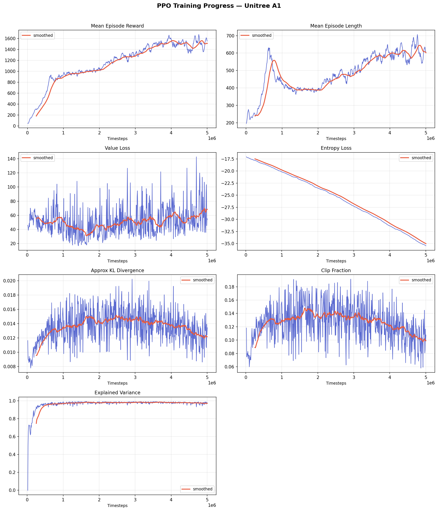

# [v1](../lab/Models/a1_walk_v1.zip)
- simple training loop with a basic reward function
- reward is based solely on forward speed
- trained for `5m` steps
- mean ep reward on the last batch: `1533.53`



reward function:
```python
reward = (
	+ 2.0 * forward_vel
	- 0.5 * lateral_vel
	- 0.01 * energy # (energy = np.sum(np.square(action)))
	+ alive_bonus
	- fall_penalty
)
```

demo video:
<video controls src="../Videos/v1-unnamed.mp4" title="Title"></video>